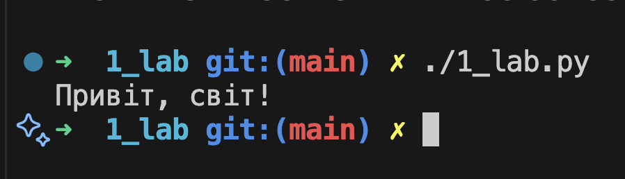

# Звіт до роботи
## Тема: _Вступні заняття: налаштування середовища, прочаток роботи з Python та Markdown;_
### Мета роботи: _Налаштувати середовище роботи VS Code, створити репозиторій Github та налаштувати інтеграцію з ним, написати першу програму на Python та створити звіт з використанням форматування Markdown;_

---
### Виконання роботи
1. Налаштували середовище роботи та почали працювати з Github, Python, Markdown;
1. Створюємо структуру проекту та папки в яких будемо працювати;
1. Написали першу програму на Python та запустили її трьома способами:
    - Останній способ з використання Shebang (`#!`) 
1. Створили ноутбук ipynb та додали декілька комірок
    - [посилання на ноутбук](./note.ipynb)
1. Запустили програму у зивичаному режимі та через Jupyter
1. Отримано наступні результати які показані на скріншотах ...
1. Навчились ...


* дописали програму, вставлений код:
    ```python
    print("Привіт, світ!")
    ```

* Написали промпт та створили свою програму на Python;

---
### Висновок:
> у висновку потрібно відповісти на запитання:

- :question: Що зроблено в роботі;
- :question: Чи досягнуто мети роботи;
- :question: Які нові знання отримано;
- :question: Чи вдалось відповісти на всі питання задані в ході роботи;
- :question: Чи вдалося виконати всі завдання;
- :question: Чи виникли складності у виконанні завдання;
- :question: Чи подобається такий формат здачі роботи (Feedback);
- :question: Побажання для покращення (Suggestions);

---