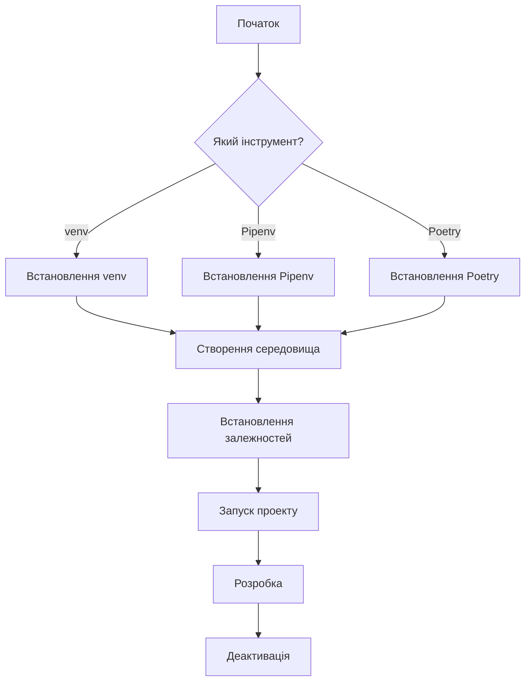

# Покрокові інструкції

## Загальна схема роботи



## Варіант 1: Робота з venv

### Початкове налаштування

```bash
# 1. Перейти в директорію проекту
cd 6_lab/1_venv

# 2. Створити віртуальне середовище
python -m venv my_env

# 3. Активувати середовище
# На macOS/Linux:
source my_env/bin/activate

# На Windows (Command Prompt):
my_env\Scripts\activate.bat

# На Windows (PowerShell):
my_env\Scripts\Activate.ps1
```

### Встановлення залежностей

```bash
# 4. Оновити pip
pip install --upgrade pip

# 5. Встановити продакшн залежності
pip install -r requirements.txt

# 6. Встановити dev залежності (опціонально)
pip install -r requirements-dev.txt

# 7. Перевірити встановлені пакети
pip list
```

### Запуск проекту

```bash
# 8. Запустити Flask додаток
python anime.py

# 9. Відкрити в браузері
# http://localhost:5000/
```

### Розробка

```bash
# Перевірка стилю коду (якщо встановлено dev залежності)
flake8 anime.py

# Перевірка типів
mypy anime.py

# Робота з додатком
# http://localhost:5000/          - головна
# http://localhost:5000/about     - персонаж
# http://localhost:5000/anime/list - список
```

### Додавання нових пакетів

```bash
# Встановити новий пакет
pip install package_name

# Оновити requirements.txt
pip freeze > requirements.txt
```

### Завершення роботи

```bash
# 10. Зупинити Flask (Ctrl+C)

# 11. Деактивувати середовище
deactivate
```

### Повторний запуск

```bash
# При наступному запуску достатньо:
cd 6_lab/1_venv
source my_env/bin/activate  # або my_env\Scripts\activate.bat
python anime.py
```

---

## Варіант 2: Робота з Pipenv

### Початкове налаштування

```bash
# 1. Встановити Pipenv (якщо ще не встановлено)
# macOS:
brew install pipenv

# Linux/Windows:
pip install --user pipenv

# 2. Перейти в директорію проекту
cd 6_lab/2_pipenv

# 3. Створити середовище та вказати версію Python
pipenv --python 3.13
```

### Встановлення залежностей

```bash
# 4. Встановити продакшн залежності
pipenv install jikanpy-v4 Flask

# 5. Встановити dev залежності
pipenv install flake8 mypy --dev

# 6. Або встановити з існуючого Pipfile
pipenv install

# 7. Перевірити дерево залежностей
pipenv graph
```

### Запуск проекту

```bash
# 8а. Варіант 1: Через pipenv run
pipenv run python anime.py

# 8б. Варіант 2: Через pipenv shell
pipenv shell
python anime.py
```

### Інформація про середовище

```bash
# Показати шлях до віртуального середовища
pipenv --venv

# Показати шлях до Python
pipenv --py

# Показати інформацію про проект
pipenv --where
```

### Розробка

```bash
# Перевірка коду через pipenv run
pipenv run flake8 anime.py
pipenv run mypy anime.py

# Або через shell
pipenv shell
flake8 anime.py
mypy anime.py
exit
```

### Додавання пакетів

```bash
# Додати продакшн пакет
pipenv install package_name

# Додати dev пакет
pipenv install package_name --dev

# Оновити пакет
pipenv update package_name

# Видалити пакет
pipenv uninstall package_name
```

### Оновлення залежностей

```bash
# Оновити всі пакети
pipenv update

# Оновити тільки lock файл
pipenv lock

# Перевірка безпеки
pipenv check
```

### Експорт залежностей

```bash
# Експортувати в requirements.txt для сумісності
pipenv requirements > requirements.txt
pipenv requirements --dev > requirements-dev.txt
```

### Завершення роботи

```bash
# Якщо використовували pipenv shell
exit

# Видалити віртуальне середовище (якщо потрібно)
pipenv --rm
```

### Повторний запуск

```bash
# При наступному запуску:
cd 6_lab/2_pipenv
pipenv run python anime.py

# Або
pipenv shell
python anime.py
```

---

## Варіант 3: Робота з Poetry

### Початкове налаштування

```bash
# 1. Встановити Poetry (якщо ще не встановлено)
# macOS/Linux/Windows (WSL):
curl -sSL https://install.python-poetry.org | python3 -

# macOS (Homebrew):
brew install poetry

# 2. Додати Poetry в PATH (якщо потрібно)
export PATH="$HOME/.local/bin:$PATH"

# 3. Перевірка
poetry --version

# 4. Перейти в директорію проекту
cd 6_lab/3_poetry
```

### Налаштування проекту

```bash
# 5а. Якщо pyproject.toml вже є
poetry install

# 5б. Якщо створюємо новий проект
poetry init  # інтерактивно відповідаємо на питання
```

### Додавання залежностей

```bash
# 6. Додати основні пакети
poetry add requests jikanpy-v4 flask

# 7. Додати dev залежності
poetry add --group dev flake8 mypy

# 8. Додати залежності для документації
poetry add --group docs mkdocs

# 9. Перевірити дерево залежностей
poetry show --tree
```

### Інформація про середовище

```bash
# Показати інформацію про середовище
poetry env info

# Показати шлях до середовища
poetry env info --path

# Список середовищ
poetry env list
```

### Запуск проекту

```bash
# 10а. Варіант 1: Через poetry run
poetry run python anime.py

# 10б. Варіант 2: Через poetry shell
poetry shell
python anime.py
```

### Робота з документацією

```bash
# Запустити mkdocs сервер для перегляду документації
poetry run mkdocs serve

# Відкрити в браузері
# http://127.0.0.1:8000/

# Збудувати статичні файли документації
poetry run mkdocs build
```

### Розробка

```bash
# Перевірка коду
poetry run flake8 anime.py
poetry run mypy anime.py

# Або через shell
poetry shell
flake8 anime.py
mypy anime.py
python anime.py
exit
```

### Робота з пакетами

```bash
# Показати всі пакети
poetry show

# Показати інформацію про пакет
poetry show flask

# Показати застарілі пакети
poetry show --outdated

# Оновити пакет
poetry update flask

# Оновити всі пакети
poetry update

# Видалити пакет
poetry remove requests
```

### Блокування залежностей

```bash
# Оновити poetry.lock
poetry lock

# Оновити без встановлення
poetry lock --no-update

# Перевірити lock файл
poetry lock --check
```

### Управління версіями

```bash
# Збільшити patch версію (0.1.0 -> 0.1.1)
poetry version patch

# Збільшити minor версію (0.1.0 -> 0.2.0)
poetry version minor

# Збільшити major версію (0.1.0 -> 1.0.0)
poetry version major

# Встановити конкретну версію
poetry version 1.0.0
```

### Експорт залежностей

```bash
# Експортувати в requirements.txt
poetry export -f requirements.txt -o requirements.txt

# З dev залежностями
poetry export -f requirements.txt --with dev -o requirements-dev.txt

# Без хешів (для pip)
poetry export -f requirements.txt --without-hashes -o requirements.txt
```

### Завершення роботи

```bash
# Якщо використовували poetry shell
exit

# Видалити віртуальне середовище (якщо потрібно)
poetry env remove python3.13
```

### Повторний запуск

```bash
# При наступному запуску:
cd 6_lab/3_poetry
poetry run python anime.py

# Або
poetry shell
python anime.py
```

---

## Порівняння команд

| Дія | venv | Pipenv | Poetry |
|-----|------|--------|--------|
| Створення середовища | `python -m venv my_env` | `pipenv --python 3.13` | `poetry install` |
| Активація | `source my_env/bin/activate` | `pipenv shell` | `poetry shell` |
| Встановлення пакету | `pip install package` | `pipenv install package` | `poetry add package` |
| Dev пакет | `pip install package` | `pipenv install --dev package` | `poetry add --group dev package` |
| Список пакетів | `pip list` | `pipenv graph` | `poetry show` |
| Запуск скрипта | `python script.py` | `pipenv run python script.py` | `poetry run python script.py` |
| Видалення пакету | `pip uninstall package` | `pipenv uninstall package` | `poetry remove package` |
| Оновлення | `pip install --upgrade package` | `pipenv update package` | `poetry update package` |
| Експорт залежностей | `pip freeze > requirements.txt` | `pipenv requirements` | `poetry export` |
| Деактивація | `deactivate` | `exit` | `exit` |

---

## Типові задачі

### Задача 1: Додати нове аніме в базу

**Що робити:**
1. Знайти MAL ID аніме на [myanimelist.net](https://myanimelist.net)
2. Запустити Flask додаток
3. Відкрити в браузері: `http://localhost:5000/anime/add/<MAL_ID>`

**Приклад:**
```bash
# Запустити додаток
poetry run python anime.py

# В браузері відкрити:
http://localhost:5000/anime/add/5114  # Fullmetal Alchemist: Brotherhood
```

### Задача 2: Переглянути список аніме

```bash
# Запустити додаток
poetry run python anime.py

# В браузері відкрити:
http://localhost:5000/anime/list
```

### Задача 3: Додати нового персонажа

```bash
# Запустити додаток
poetry run python anime.py

# В браузері відкрити:
http://localhost:5000/character/add/40  # Spike Spiegel
```

### Задача 4: Перевірити код перед commit

```bash
# venv
source my_env/bin/activate
flake8 anime.py
mypy anime.py
deactivate

# Pipenv
pipenv run flake8 anime.py
pipenv run mypy anime.py

# Poetry
poetry run flake8 anime.py
poetry run mypy anime.py
```

### Задача 5: Оновити всі залежності

```bash
# venv
source my_env/bin/activate
pip list --outdated
pip install --upgrade package_name
pip freeze > requirements.txt
deactivate

# Pipenv
pipenv update

# Poetry
poetry update
```

### Задача 6: Створити документацію

```bash
# Тільки з Poetry (у папці 3_poetry)
cd 6_lab/3_poetry

# Запустити сервер документації
poetry run mkdocs serve

# Відкрити в браузері:
http://127.0.0.1:8000/

# Збудувати статичні файли
poetry run mkdocs build
```

### Задача 7: Переставити середовище

```bash
# venv
rm -rf my_env
python -m venv my_env
source my_env/bin/activate
pip install -r requirements.txt

# Pipenv
pipenv --rm
pipenv install

# Poetry
poetry env remove python3.13
poetry install
```

---

## Поширені помилки та рішення

### Помилка 1: Command not found

**Симптом:**
```bash
-bash: pipenv: command not found
-bash: poetry: command not found
```

**Рішення:**
```bash
# Для Pipenv
pip install --user pipenv
export PATH="$HOME/.local/bin:$PATH"

# Для Poetry
curl -sSL https://install.python-poetry.org | python3 -
export PATH="$HOME/.local/bin:$PATH"
```

### Помилка 2: SSL Certificate error

**Симптом:**
```
SSL: CERTIFICATE_VERIFY_FAILED
```

**Рішення:**
```bash
# macOS
/Applications/Python\ 3.13/Install\ Certificates.command

# Або тимчасово
pip install --trusted-host pypi.org --trusted-host files.pythonhosted.org package_name
```

### Помилка 3: Permission denied

**Симптом:**
```
Permission denied: '/usr/local/lib/python3.13/site-packages/'
```

**Рішення:**
```bash
# Використовувати віртуальне середовище!
# АБО встановити з --user
pip install --user package_name
```

### Помилка 4: Port already in use

**Симптом:**
```
Address already in use
Port 5000 is in use by another program
```

**Рішення:**
```bash
# Знайти процес
lsof -i :5000

# Вбити процес
kill -9 <PID>

# Або змінити порт у коді
app.run(debug=True, port=5001)
```

### Помилка 5: Module not found

**Симптом:**
```
ModuleNotFoundError: No module named 'flask'
```

**Рішення:**
```bash
# Перевірити, чи активовано середовище
which python

# Якщо ні - активувати
source my_env/bin/activate  # venv
pipenv shell                # Pipenv
poetry shell                # Poetry

# Встановити залежності
pip install -r requirements.txt  # venv
pipenv install                   # Pipenv
poetry install                   # Poetry
```

---

## Корисні поради

### 💡 Порада 1: Автоматична активація

Додайте в `~/.bashrc` або `~/.zshrc`:

```bash
# Автоматична активація venv
cd() {
    builtin cd "$@"
    if [[ -d ./my_env ]]; then
        source ./my_env/bin/activate
    fi
}
```

### 💡 Порада 2: Alias для швидкого запуску

```bash
# В ~/.bashrc або ~/.zshrc
alias anime-venv="cd ~/6_lab/1_venv && source my_env/bin/activate && python anime.py"
alias anime-pipenv="cd ~/6_lab/2_pipenv && pipenv run python anime.py"
alias anime-poetry="cd ~/6_lab/3_poetry && poetry run python anime.py"
alias docs="cd ~/6_lab/3_poetry && poetry run mkdocs serve"
```

### 💡 Порада 3: .gitignore

Створіть `.gitignore`:

```
# Віртуальні середовища
my_env/
.venv/
venv/

# База даних
*.db
*.sqlite
*.sqlite3

# Python
__pycache__/
*.py[cod]
*$py.class
*.so

# IDE
.vscode/
.idea/
*.swp
*.swo

# Poetry
poetry.lock  # опціонально

# OS
.DS_Store
Thumbs.db
```

### 💡 Порада 4: Скрипт швидкого старту

Створіть `start.sh`:

```bash
#!/bin/bash

echo "Який інструмент використовувати?"
echo "1) venv"
echo "2) Pipenv"
echo "3) Poetry"
read -p "Вибір (1-3): " choice

case $choice in
    1)
        cd 6_lab/1_venv
        source my_env/bin/activate
        python anime.py
        ;;
    2)
        cd 6_lab/2_pipenv
        pipenv run python anime.py
        ;;
    3)
        cd 6_lab/3_poetry
        poetry run python anime.py
        ;;
    *)
        echo "Невірний вибір"
        ;;
esac
```

Зробіть виконуваним:
```bash
chmod +x start.sh
./start.sh
```

---

## Чеклист виконання лабораторної

- [ ] Встановлено Python 3.13
- [ ] Встановлено venv (вбудований)
- [ ] Встановлено Pipenv
- [ ] Встановлено Poetry
- [ ] Створено віртуальне середовище з venv
- [ ] Встановлено залежності через pip
- [ ] Запущено проект з venv
- [ ] Створено середовище з Pipenv
- [ ] Встановлено залежності через Pipenv
- [ ] Запущено проект з Pipenv
- [ ] Ініціалізовано проект з Poetry
- [ ] Встановлено залежності через Poetry
- [ ] Запущено проект з Poetry
- [ ] Додано аніме в базу даних
- [ ] Переглянуто список аніме
- [ ] Додано персонажа
- [ ] Перевірено код за допомогою flake8
- [ ] Перевірено типи за допомогою mypy
- [ ] Запущено mkdocs сервер
- [ ] Переглянуто документацію
- [ ] Порівняно три підходи

---

## Наступні кроки

- Експериментуйте з різними аніме та персонажами
- Спробуйте додати нові функції до проекту
- Порівняйте продуктивність різних інструментів
- Створіть власний проект з використанням отриманих знань

**Успіхів у навчанні! 🚀**
