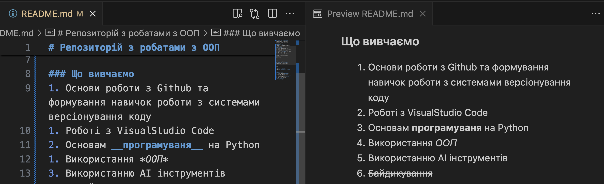

# Репозиторій з робатами з ООП
> Лабораторні для групи КН-210 з предмету: Обєктно орієнтоване програмування

---

### Місце та час
- Відбуваються в аудиторії 301Ла1
* Кожного понеділка та середи

### Що вивчаємо
1. Основи роботи з Github та формування навичок роботи з системами версіонування коду
1. Роботі з VisualStudio Code
2. Основам __програмуваня__ на Python
1. Використання *ООП*
3. Використанню АІ інструментів
1. ~~Байдикування~~

| Назва методу | Опис методу |
|---|---|
| `print` | виводить передану інформацію |

### Виконав індивідуальне завдання
- написав нову функцію
    ```python
    def new_fun():
        print("Hello")
    ```
    ```bash
    python main.py


## [Перехід на папку з скріншотами](./screenshots/README.md)



[Повертаємось до згенерованого АІ](#репозиторій-з-роботами-з-ооп)

---
> АІ відредагував наш текст

# Репозиторій з роботами з ООП
Лабораторні роботи для групи **КН-210** з дисципліни: *Об'єктно-орієнтоване програмування*

---

### 📍 Місце та час
- Аудиторія: **301Ла1**
- Заняття: **понеділок та середа**

---

### 📘 Що вивчаємо
1. Основи роботи з **GitHub** та системами керування версіями
2. Використання **Visual Studio Code**
3. Основи програмування на **Python**
4. Принципи та практики **ООП**
5. Використання сучасних **AI-інструментів**
6. ~~Байдикування~~

